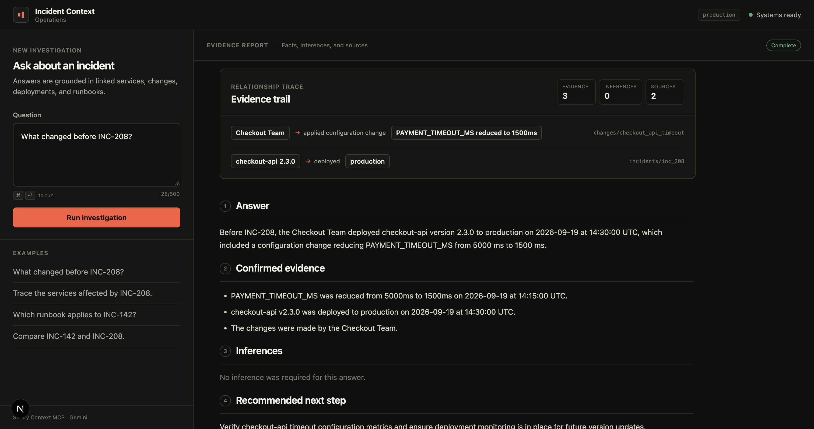
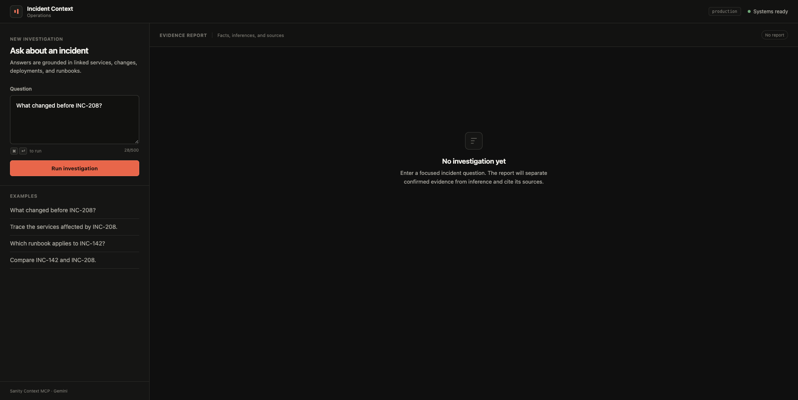

# Incident Context

Evidence-grounded production incident investigation powered by structured operational data.

[Try the live application](https://incident-context.vercel.app/)

Incident Context connects services, deployments, configuration changes, incidents, and runbooks in
Sanity. An investigation agent navigates those relationships through Sanity Context MCP and keeps
confirmed evidence separate from inference.

## Product

### Evidence report

The agent turns linked operational records into a visible relationship trail, shows evidence,
inference, and source counts, recommends a next step, and preserves the Sanity Context source paths
behind the report.



### Empty investigation state

Before a report is generated, the workspace presents a focused question field and four example
investigations. On desktop, the controls remain available while completed reports scroll independently.



## Why structured context matters

During an incident, useful context is usually spread across service ownership, dependency graphs,
deployments, configuration changes, previous incidents, and version-specific runbooks. Keyword
search can find similar words, but it cannot reliably explain how those records are related.

Incident Context can answer questions such as:

- What changed before `INC-208`?
- Which services and dependencies were affected?
- Which runbook applies to `INC-142`?
- How do `INC-142` and `INC-208` differ?

Every report separates confirmed evidence from inference and includes the Sanity Context sources
used to produce the answer.

## Architecture

```text
Next.js interface
       │
       ▼
Gemini investigation agent
       │
       ▼
Sanity Context MCP
       │
       ▼
Sanity Knowledge Base
       │
       ▼
Services · Deployments · Changes · Runbooks · Incidents
```

The content model captures these relationships:

```text
Service    → depends on → Service
Deployment → belongs to → Service
Change     → modifies   → Service
Incident   → affects    → Service
Incident   → relates to → Deployment, Change, Runbook
Runbook    → applies to → Service and version
```

## Demo scenarios

The demo includes four connected services and two incidents:

- `web-app → checkout-api → payment-api → postgres`
- `INC-142`: payment failures caused by database connection pool exhaustion
- `INC-208`: checkout timeouts following a payment timeout configuration change

Try these questions:

```text
What changed before INC-208?
Trace the services affected by INC-208.
Which runbook applies to INC-142?
Compare INC-142 and INC-208.
```

## Sanity project

- Project ID: `9y5yvfun`
- Dataset: `production`
- Knowledge source: structured Sanity documents
- MCP endpoint: Sanity Context MCP

Authentication tokens are server-side secrets and are not included in the repository.

## Production safeguards

- Per-client request rate limiting
- 500-character question limit
- 30-second request timeout
- Clear Gemini, Sanity, timeout, and rate-limit errors
- No unsupported answer when the knowledge source is unavailable
- `/api/health` configuration check
- MCP availability and failure-path tests

## Stack

- Next.js and TypeScript
- Sanity Studio and Sanity Content Lake
- Sanity Knowledge Base and Context MCP
- Vercel AI SDK
- Google Gemini 3.5 Flash-Lite
- MCP Failure Lab
- Vercel

## Repository structure

```text
agent/   Next.js investigation interface and API
sanity/  Sanity Studio, schemas, and demo data
```

## Local development

### Agent

Copy `agent/.env.example` to `agent/.env.local` and provide:

```text
GOOGLE_GENERATIVE_AI_API_KEY
SANITY_CONTEXT_MCP_URL
SANITY_ORGANIZATION_TOKEN
```

Then start the application:

```bash
cd agent
pnpm install
pnpm dev
```

The credentials must remain server-side. Do not prefix them with `NEXT_PUBLIC_` or commit local
environment files.

### Sanity Studio

```bash
cd sanity
pnpm install
pnpm dev
```

## MCP Failure Lab

The agent uses the published [`mcp-failure-lab`](https://www.npmjs.com/package/mcp-failure-lab)
package to verify both the live Sanity Context endpoint and expected MCP failure behavior.

From `agent/`, run the complete suite:

```bash
pnpm test:mcp
```

Run only the authenticated live check:

```bash
pnpm test:mcp:live
```

The live scenario calls `initial_context` and verifies that the Sanity knowledge base responds
successfully within ten seconds. It reads `SANITY_ORGANIZATION_TOKEN` from the local `.env` file and
constructs the authorization header at runtime, so no bearer token is stored in a test fixture.

Run only the local resilience scenarios:

```bash
pnpm test:mcp:faults
```

These scenarios cover bounded delays, hanging requests, malformed responses, and connection loss.
They run without contacting the live knowledge base.

## Verification

From `agent/`:

```bash
pnpm typecheck
pnpm build
pnpm test:mcp
```

The live MCP check requires `SANITY_ORGANIZATION_TOKEN`.

## License

MIT
